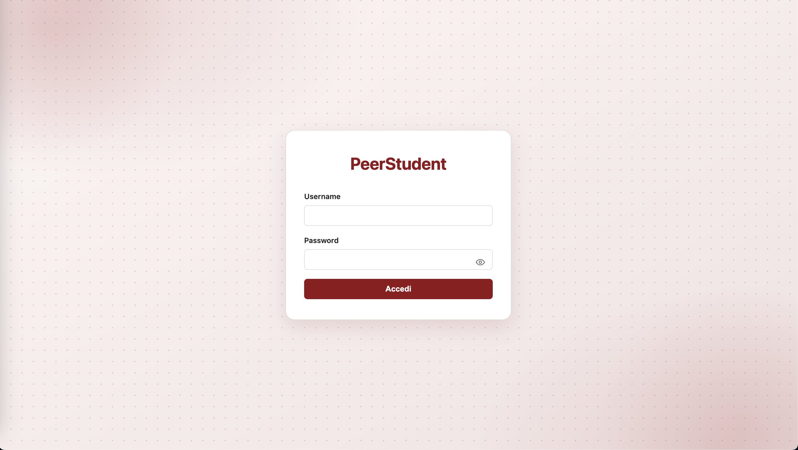

# PeerStudent

**Piattaforma di micro-tutoraggio fra studenti universitari.**

Il progetto nasce da un'idea personale, costruita attorno a un problema reale, e si è sviluppato nell'ambito di un laboratorio universitario.



---

## L'idea

Preparare un esame universitario produce molto più di un voto. Chi lo supera ha capito quali argomenti vengono chiesti davvero, quali passaggi sembrano ostici e non lo sono, dove conviene insistere e dove no. È una conoscenza pratica, costruita in settimane di lavoro, che un libro di testo non contiene.

Questa conoscenza oggi si disperde quasi del tutto. Quando circola, lo fa attraverso canali informali: un compagno che spiega un passaggio a un altro, un gruppo di studio. 
Funziona, ma solo per chi si trova nel posto giusto. Chi una rete di contatti non ce l'ha ancora — le matricole, gli studenti fuori sede — deve ricostruirsela da zero proprio quando avrebbe più bisogno di aiuto, cioè sotto esame.

Il risultato è una disparità che non dipende dalla preparazione né dall'impegno, ma solo da quante persone conosci. Due studenti con le stesse difficoltà ricevono aiuto diverso a seconda di chi hanno intorno.

**PeerStudent rende visibile e prenotabile una disponibilità che esiste già, ma molto limitata.** Chi ha superato un esame pubblica appuntamenti di ripasso su argomenti specifici, indicando quando, dove e per quante persone. Gli altri studenti li cercano per materia o per argomento, consultano il profilo di chi li tiene e inviano una richiesta motivata; il tutor legge le motivazioni e sceglie chi ammettere entro i posti disponibili. Al termine dell'incontro chi vi ha partecipato lascia una valutazione, che va a comporre la reputazione pubblica del tutor.

Le scelte di progetto seguono da questa idea. **La motivazione è obbligatoria** perché il tutor possa decidere su basi concrete invece che in ordine di arrivo. **I posti sono limitati e li stabilisce chi tiene l'incontro**, perché un ripasso efficace non è una lezione frontale. **Le valutazioni sono pubbliche** perché chi cerca aiuto possa scegliere con cognizione di causa, e perché chi si rende disponibile ne riceva un riconoscimento visibile.

L'obiettivo è duplice: dare a chiunque accesso a un aiuto che oggi passa per i canali sbagliati, e allo stesso tempo valorizzare chi insegna — spiegare consolida la propria preparazione, e le valutazioni ricevute riconoscono pubblicamente il contributo dato alla comunità studentesca.

---

## Come funziona

L'applicazione distingue due ruoli, con permessi diversi.

**Lo studente** consulta gli appuntamenti disponibili, li filtra per materia o li cerca per titolo, apre il profilo di un tutor per vederne la reputazione, e invia una richiesta di partecipazione motivando il proprio interesse. Segue lo stato delle proprie richieste, può ritirarle, e quando l'incontro si è svolto lascia una valutazione.

**Il tutor** pubblica gli appuntamenti indicando materia, argomenti, data, luogo o modalità online e numero di posti. Riceve le richieste con le relative motivazioni e decide quali accettare entro i posti disponibili. Può allegare materiali didattici, inviare avvisi ai partecipanti, e gestire il ciclo di vita dell'appuntamento: chiudere le iscrizioni, segnarlo come svolto, annullarlo.

Per gli appuntamenti online lo studente indica la propria email istituzionale al momento della richiesta, e riceve il collegamento alla videochiamata fra le proprie notifiche soltanto dopo essere stato ammesso.

---

## Architettura

Il progetto è composto da **due applicazioni indipendenti** che comunicano via HTTP scambiando JSON.

```
progetto_TWeb/
├── peerlab-backend/     Spring Boot — API REST e persistenza
└── peerlab-frontend/    React — Single-Page Application
```

### Back-end

Organizzato per responsabilità, secondo il pattern MVC:

| Package | Contenuto |
|---|---|
| `model` | Le 8 entità JPA e gli enum dei valori fissi |
| `repository` | Le interfacce di accesso ai dati, una per entità |
| `service` | La business logic: regole di validazione e autorizzazione |
| `controller` | I punti d'ingresso HTTP e la gestione centralizzata degli errori |
| `dto` | Gli oggetti scambiati con il front-end |
| `mapper` | La conversione fra entità e DTO |
| `exception` | Le eccezioni applicative |
| `config` | Filtro di autenticazione e caricamento dei dati iniziali |

Il flusso di una richiesta attraversa gli strati in sequenza: **filtro → controller → service → repository**. Ogni strato conosce soltanto quello sottostante — il repository ignora l'esistenza dei controller, e i service non sanno nulla di HTTP: lanciano eccezioni, che un gestore centralizzato traduce negli status code appropriati.

### Front-end

Single-Page Application: un unico documento HTML il cui DOM viene aggiornato dall'applicazione, senza alcuna navigazione fra pagine.

| Cartella | Contenuto |
|---|---|
| `components` | I 16 componenti dell'interfaccia |
| `api` | Tutte le chiamate al back-end, centralizzate in un modulo |
| `types` | Le definizioni TypeScript dei dati scambiati |
| `hooks` | Hook personalizzati riutilizzabili |

Il componente radice `App` mantiene lo stato dell'utente autenticato e monta una vista diversa a seconda del ruolo. Le chiamate al server passano tutte da un unico modulo, così che l'indirizzo del back-end, l'invio del cookie di sessione e la gestione degli errori siano definiti in un punto solo.

---

## Scelte tecniche

Alcune decisioni che hanno orientato l'implementazione.

**I DTO non espongono le entità.** Le classi JPA contengono dati che non devono raggiungere il client — la password su tutte — e hanno relazioni bidirezionali che manderebbero la serializzazione in ricorsione infinita. I DTO risolvono entrambi i problemi e permettono di esporre dati calcolati, come i posti ancora disponibili.

**I posti disponibili non sono memorizzati.** Vengono ottenuti contando le prenotazioni accettate. Memorizzarli significherebbe mantenere allineati due dati che possono divergere: un caso non gestito e il database direbbe il falso. Calcolandoli, il valore è coerente per costruzione.

**Il feedback è collegato alla prenotazione, non allo studente.** Questo rende strutturalmente impossibile valutare un incontro a cui non si è partecipato: senza prenotazione non esiste nulla da valutare. Un vincolo di unicità impedisce inoltre di valutare due volte lo stesso appuntamento.

**L'identità dell'utente proviene dalla sessione, non dalla richiesta.** Quando uno studente prenota, il suo identificativo non viene letto dal body: il client non è una fonte attendibile, e accettarlo significherebbe permettere a chiunque di agire a nome altrui.

**Il link della videochiamata è un dato riservato.** Non viene nascosto graficamente: non entra proprio nella risposta JSON per chi non ha diritto di vederlo. Nasconderlo lato interfaccia sarebbe inutile, dato che basterebbe ispezionare la richiesta.

**L'autenticazione è gestita da un filtro.** Intercetta ogni richiesta prima che raggiunga i controller e risponde `401` se la sessione non contiene un utente. Trattandosi di un controllo trasversale, concentrarlo in un punto solo evita di ripeterlo in ogni handler con il rischio di dimenticarlo.

---

## Tecnologie

**Back-end** — Java 21 · Spring Boot 3.5 · Spring Data JPA con Hibernate · PostgreSQL · Maven

**Front-end** — TypeScript · React 19 · Vite · HTML e CSS scritti a mano, senza librerie di componenti

---

## Avvio

### Prerequisiti

- JDK 21 o superiore
- Node.js 18 o superiore
- PostgreSQL in esecuzione sulla porta 5432

### Database

```sql
CREATE DATABASE peerlab;
```

Le tabelle vengono generate automaticamente da Hibernate al primo avvio, a partire dalle classi annotate `@Entity`. Le credenziali di accesso si configurano in `peerlab-backend/src/main/resources/application.properties`.

### Back-end

```bash
cd peerlab-backend
./mvnw spring-boot:run
```

In ascolto su `http://localhost:8080`. Al primo avvio popola il database con dati di esempio: 3 materie, 12 argomenti, 10 appuntamenti e 8 utenti.

### Front-end

```bash
cd peerlab-frontend
npm install
npm run dev
```

Disponibile su `http://localhost:5173`.

---

## Utenti di prova

| Username | Password | Ruolo |
|---|---|---|
| `marco` | `marco123` | Studente |
| `sara` | `sara123` | Studente |
| `giulia` | `giulia123` | Tutor |
| `davide` | `davide123` | Tutor |
| `elena` | `elena123` | Tutor |
| `luca` | `luca123` | Tutor |
| `chiara` | `chiara123` | Tutor |
| `matteo` | `matteo123` | Tutor |

> Le password sono memorizzate in chiaro: si tratta di un proof-of-concept, non di un'applicazione destinata alla produzione.

---

## Limiti noti

Il progetto è un proof-of-concept e presenta alcuni limiti dichiarati.

Le password non sono cifrate. Gli aggiornamenti non sono in tempo reale: lo studente vede l'esito della propria richiesta ricaricando la pagina, mentre una versione completa userebbe WebSocket. Il link della videochiamata e gli avvisi vengono mostrati nell'applicazione ma non spediti per email, cosa che richiederebbe un servizio SMTP. Le sessioni HTTP risiedono nella memoria del server, il che impedirebbe di scalare su più istanze senza un archivio condiviso. La registrazione degli utenti non è implementata: in un contesto reale l'applicazione si appoggerebbe al sistema di autenticazione di ateneo.

---

## NOTE

Il codice e la documentazione sono consultabili, ma non ne è consentito il riutilizzo. Vedi il file LICENSE.
